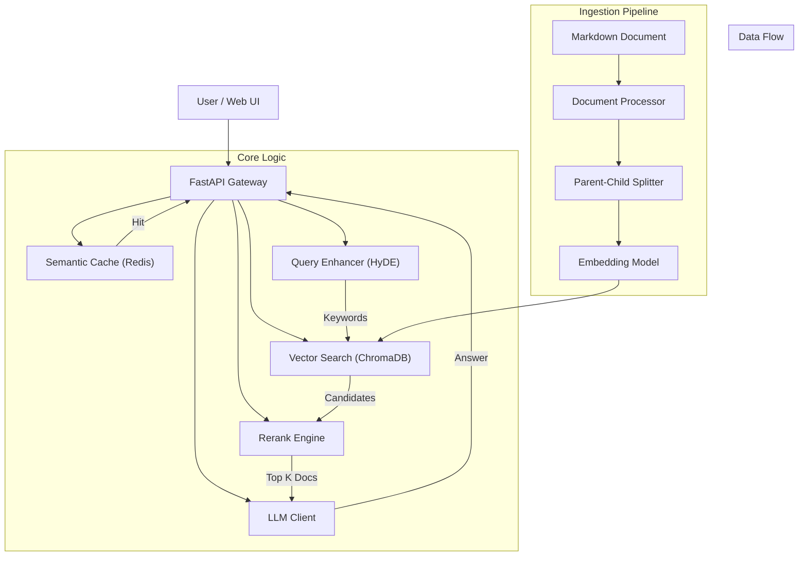

# 🤖 RAG Intelligent Q&A System

> Enterprise-grade Intelligent Q&A Solution based on Retrieval-Augmented Generation (RAG).

[](https://www.python.org/)
[](https://fastapi.tiangolo.com/)
[](LICENSE)

## 📖 Table of Contents

- [🤖 RAG Intelligent Q\&A System](#-rag-intelligent-qa-system)
  - [📖 Table of Contents](#-table-of-contents)
  - [Introduction](#introduction)
  - [✨ Key Features](#-key-features)
  - [System Architecture](#system-architecture)
    - [Project Structure](#project-structure)
  - [Quick Start](#quick-start)
    - [Prerequisites](#prerequisites)
    - [Installation](#installation)
  - [Feature Details](#feature-details)
    - [PDF to Markdown Conversion](#pdf-to-markdown-conversion)
    - [Query Enhancement (HyDE)](#query-enhancement-hyde)
    - [Adaptive Thresholds](#adaptive-thresholds)
    - [Semantic Caching](#semantic-caching)
  - [Configuration](#configuration)
  - [API Documentation](#api-documentation)
    - [Query Endpoint](#query-endpoint)
    - [Health Check](#health-check)
  - [Tech Stack](#tech-stack)
  - [License](#license)

## Introduction

The RAG Intelligent Q&A System is a robust solution combining advanced Vector Retrieval, Semantic Reranking, and Large Language Models (LLM) to provide accurate answers based on your documents. It features a modern architecture designed for precision and performance.

## ✨ Key Features

- 🔍 **Intelligent Retrieval**: Efficient document retrieval based on vector similarity.
- 🎯 **Precision Reranking**: Uses Rerank models to re-score candidates for higher accuracy.
- 🧠 **Smart Generation**: Integrated LLM for natural language answer generation.
- 🚀 **Query Enhancement**: HyDE technology improves retrieval for colloquial questions.
- ⚡ **Adaptive Thresholds**: Automatically applies optimal thresholds for different modes.
- 📚 **Smart Chunking**: Parent-Child indexing strategy for better context.
- 💾 **Semantic Cache**: Redis-based caching to save costs and reduce latency.
- 📄 **PDF Support**: Integrated MinerU for automatic PDF to Markdown conversion with GPU acceleration.
- 🎨 **Modern UI**: Clean and responsive Web Interface.
- 📊 **Detailed Logging**: Comprehensive logs for debugging and analysis.

## System Architecture



### Project Structure

```
rag_project/
├── config.py                 # Configuration Management
├── main.py                   # FastAPI Application Entry
├── ingest.py                 # Data Ingestion Script
├── run.py                    # Quick Start Script
├── pdf_converter.py          # PDF to Markdown Converter (MinerU)
├── convert_pdf.py            # PDF Conversion CLI Tool
├── requirements.txt          # Python Dependencies
├── env.example               # Environment Variables Template
├── README.md                 # Documentation
│
├── core/                     # Core Modules
│   ├── embeddings.py         # Embedding Engine
│   ├── vector_store.py       # Vector DB Manager
│   ├── llm_client.py         # LLM Client
│   ├── reranker.py           # Rerank Engine
│   ├── query_enhancer.py     # HyDE Module
│   ├── semantic_cache.py     # Redis Cache Manager
│   └── processor.py          # Document Processor
│
├── utils/                    # Utilities
│   ├── logger.py             # Logging System
│   ├── exceptions.py         # Custom Exceptions
│   └── responses.py          # Standard Responses
│
└── static/                   # Frontend Assets
    └── index.html            # Web Interface
```

## Quick Start

### Prerequisites

- Python 3.8+
- Redis Server (Optional, for caching)
- SiliconFlow API Key (for LLM and Rerank)

### Installation

1. **Clone the repository**
   ```bash
   git clone <repository-url>
   cd rag_project
   ```

2. **Create Virtual Environment**
   ```bash
   # Windows
   python -m venv venv
   venv\Scripts\activate

   # Linux/macOS
   python3 -m venv venv
   source venv/bin/activate
   ```

3. **Install Dependencies**
   ```bash
   pip install -r requirements.txt
   ```

4. **Configure Environment**
   ```bash
   cp env.example .env
   # Edit .env and fill in your API Keys
   ```

5. **Download Embedding Model**
   Place your model in `models/acge_text_embedding` or configure `LOCAL_EMBEDDING_MODEL_PATH` in `.env`.

6. **Prepare Data**

   **Option A: Use Existing Markdown**
   Place your `book.md` in the project root.

   **Option B: Convert from PDF (Recommended)**
   ```bash
   # Convert PDF with GPU acceleration (default)
   python convert_pdf.py your_document.pdf

   # Or convert using CPU only
   python convert_pdf.py your_document.pdf --no-gpu

   # Or use ingest.py directly (convert + ingest in one step)
   python ingest.py --pdf your_document.pdf --force
   ```

   The PDF converter will:
   - Convert PDF to Markdown using MinerU
   - Extract and organize images
   - Copy files to the project directory
   - Update image paths automatically

7. **Ingest Data**
   ```bash
   python ingest.py
   ```

8. **Run Server**
   ```bash
   python run.py
   ```

   - **Web UI**: http://localhost:8000
   - **API Docs**: http://localhost:8000/docs

## Feature Details

### PDF to Markdown Conversion

The system integrates **MinerU**, a powerful PDF parsing tool, to automatically convert PDF documents to Markdown format with image extraction.

**Features**:
- 🚀 **GPU Acceleration**: Faster processing with CUDA-enabled GPUs
- 📷 **Image Extraction**: Automatically extracts and organizes images
- 🔄 **Path Management**: Automatically updates image paths in Markdown
- ⚙️ **Flexible Options**: Support for both GPU and CPU modes

**Usage**:

```bash
# Basic conversion (GPU mode, default)
python convert_pdf.py document.pdf

# CPU mode (no GPU)
python convert_pdf.py document.pdf --no-gpu

# Specify GPU device
python convert_pdf.py document.pdf --gpu-id 1

# Advanced: Keep original output structure
python convert_pdf.py document.pdf --no-copy --output-dir custom_output

# One-step convert and ingest
python ingest.py --pdf document.pdf --force
```

**Output Structure**:
```
pdf_output/
└── document/
    └── auto/
        ├── document.md       # Converted Markdown
        └── images/           # Extracted images
            ├── image_1.png
            └── image_2.jpg
```

**Configuration** (`.env`):
```bash
PDF_USE_GPU=True           # Enable GPU acceleration
PDF_GPU_ID=0               # GPU device ID (default: 0)
```

### Query Enhancement (HyDE)

**Problem**: User queries are often short and colloquial (e.g., "how to save?"), while documents are technical (e.g., "database persistence mechanisms"). This mismatch leads to poor vector retrieval.

**Solution**: The system generates "Hypothetical Keywords" using a lightweight LLM before searching.
1. User: "how to save?"
2. HyDE: Generates "database, persistence, storage, SQL, commit"
3. Search: Searches for both original query and generated keywords.
4. Result: Significantly improved recall.

### Adaptive Thresholds

The system employs a dual-threshold strategy to balance Precision and Recall:

| Mode | Threshold | Description |
|------|-----------|-------------|
| **Precision Mode** (with Rerank) | **0.20** | Looser initial threshold. We trust the Reranker to filter out noise later. |
| **Fast Mode** (Direct) | **0.50** | Strict threshold. Since there's no second check, we must ensure high similarity initially. |

### Semantic Caching

Powered by Redis, the semantic cache doesn't just match exact strings—it matches meaning.

- **Direct Hit (>0.98)**: Returns cached answer immediately.
- **Confirm Needed (>0.95)**: Asks user "Did you mean...?"
- **Miss (<0.95)**: Proceed to LLM.

## Configuration

Key environment variables in `.env`:

| Variable | Description | Required |
|----------|-------------|----------|
| `SILICONFLOW_API_KEY` | API Key for LLM/Reranker | Yes |
| `LOCAL_EMBEDDING_MODEL_PATH` | Path to local model | Yes |
| `REDIS_HOST` | Redis Host | No |
| `RETRIEVAL_COUNT` | Vector Search Top N | No (Default: 10) |
| `RERANK_TOP_K` | Rerank Top K | No (Default: 3) |

## API Documentation

### Query Endpoint

`POST /query`

```json
{
  "prompt": "What is RAG?",
  "use_rerank": true,
  "use_query_enhancement": false
}
```

### Health Check

`GET /health`

Returns system status and document counts.

## Tech Stack

- **Framework**: FastAPI
- **Vector DB**: ChromaDB
- **LLM / Rerank**: SiliconFlow API (DeepSeek, BGE)
- **Embeddings**: Sentence Transformers (Local)
- **Cache**: Redis
- **Frontend**: HTML5 / JavaScript

## License

MIT License
